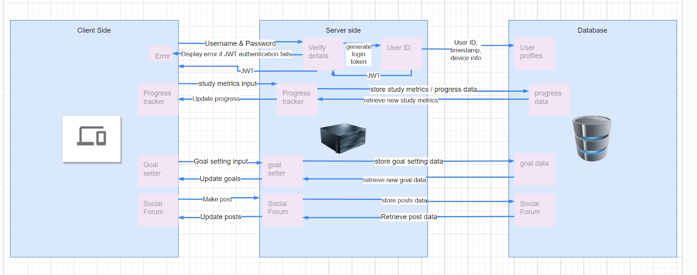
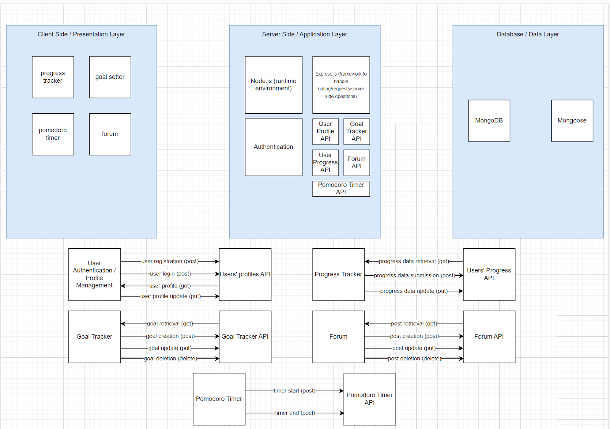
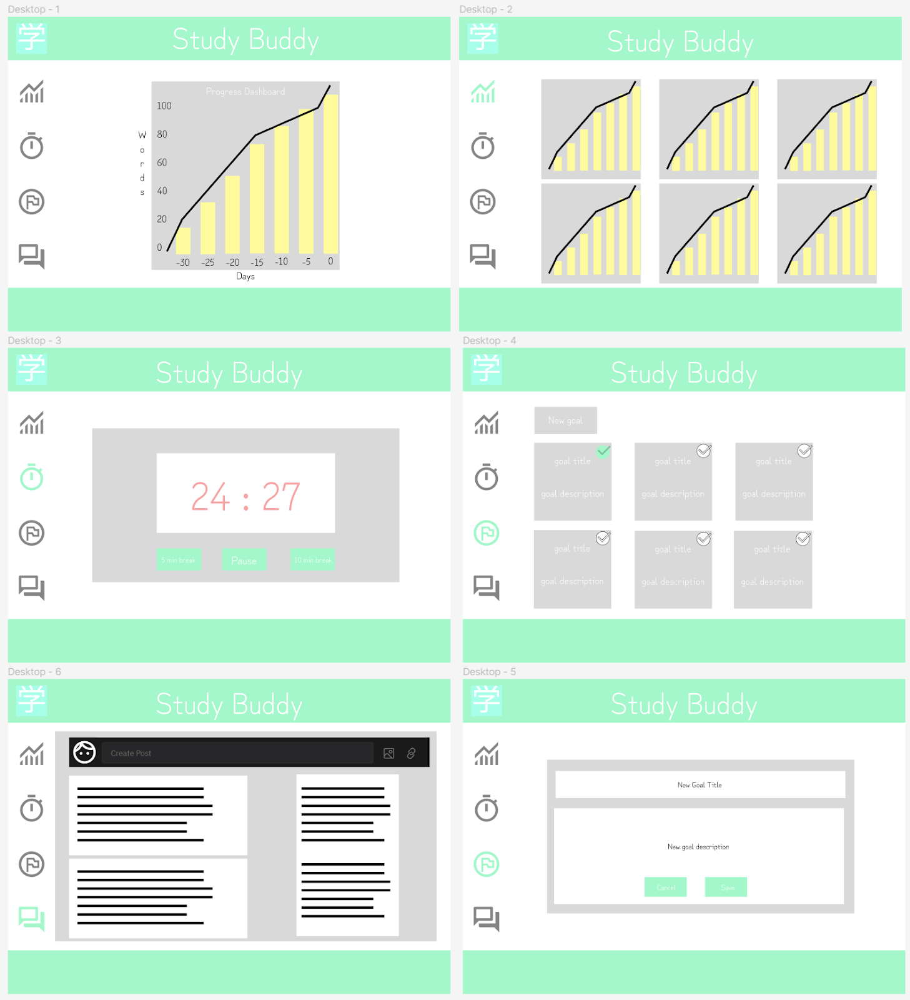
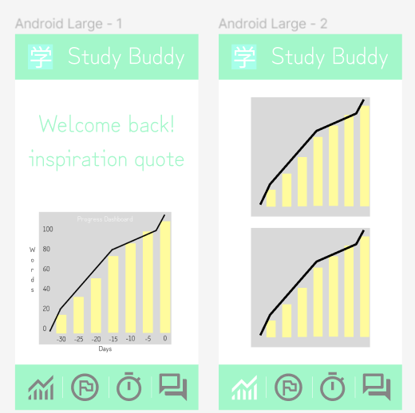
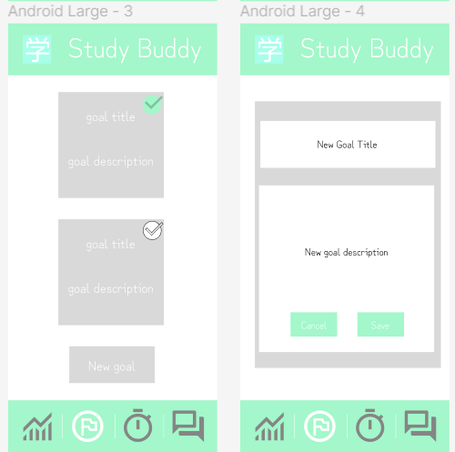
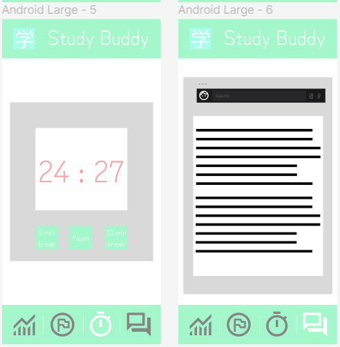
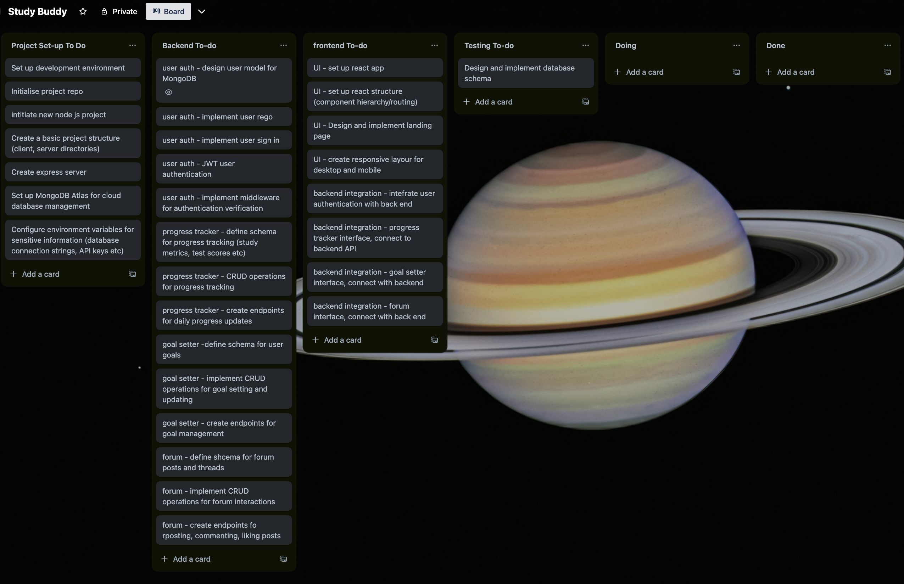
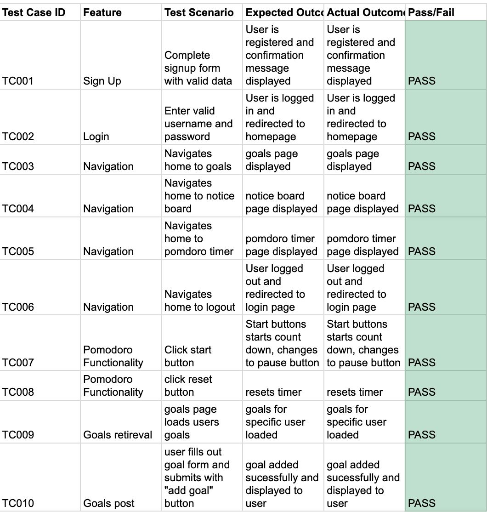
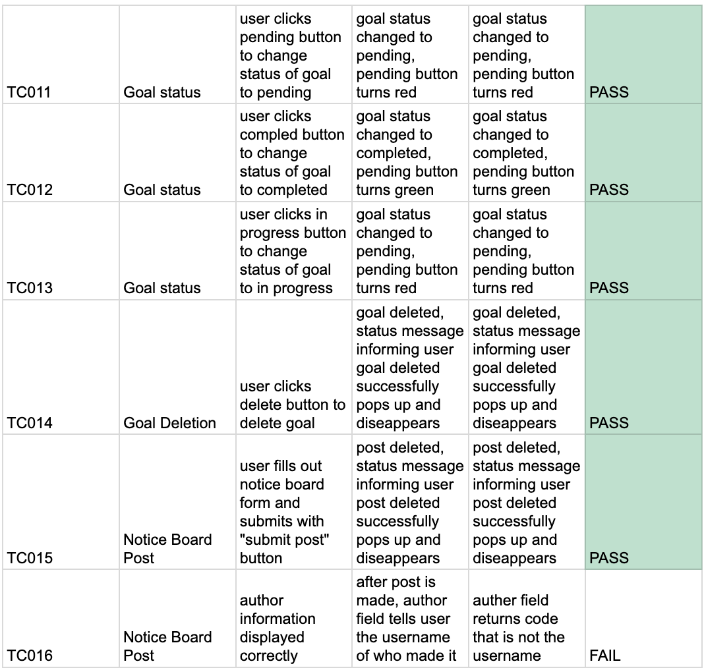
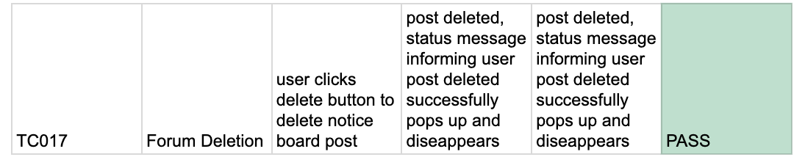

# FULL STACK APPLICATION - PART B

Connor Hay

 </Bb>

Please note: Sometimes app does not start on log in page. I tried to debug but could never figure out why. I think it has something to do with concurently. If started separately from server and client, no issue. If the issue occurs, please go to http://localhost:3000/login

I also tried my best to deploy the app with Heroku and nelify, but my github student status was rejected and never got access to Heroku. I also couldn't figure it out. 

However, I put so much love and energy and days off work into this project, I hope you like it!

If you make your own account, you wont have goals because you'll need to make some! :)

### Purpose:

The app has been designed to be a social progress tracker and goal setter for test takers studying for the IELTS English test. The IELTS English test is a critically important test for foreigners moving to Australia for work and study, or leaving Australia to pursue work and study in other English-majority countries. 
The app will serve as a central hub for all the test takers’ study progress tracking and goal setting needs. The progress tracking aspect of the app will help test takers to identify their strengths and weaknesses in English, allowing them to develop a comprehensive understanding of their own English Language ability. The goal setting aspect of the app will allow test takers to take the data from their progress tracker, and use it to structure an effective and data-backed study regime that will allow them to achieve the outcomes they desire in their English ability and IELTS test results quicker. 
The social purpose of the app is to allow test takers to interact with one another through forums, allowing knowledge sharing and emotional support to help test takers through the test preparation and test taking processes. While this didn't fully materialise, a notice board was created for users to share posts that can be helpful tips/blog posts etc etc.  

###R1. Functionality:

The app will be divided into four main sections:

#### 1. Progress Tracker

The Progress Tracker monitors daily performance across multiple metrics to enhance English proficiency and test preparation:

- **Minutes Studied**: Total of all metrics below.
- **Number of Words Learnt**
- **Number of Reading Exercises Completed**
- **Number of Listening Exercises Completed**
- **Number of Grammar Exercises Completed**
- **Number of Minutes of English Media Consumed**
- **Number of Minutes Conversing in English**: With friends, family, and acquaintances.
- **Number of IELTS-Specific Practice Questions Completed**
- **Test/Quiz Results**: For each skill (listening, reading, writing, speaking).

#### 2. Pomodoro Timer

A study timer leveraging the Pomodoro technique to structure and optimise study sessions.

#### 3. Goal Setter

Enables users to set personalised goals and receive app-generated feedback based on their progress tracker data. Goals can include:

- **Minutes to Study Per Day**
- **Words to Learn**
- **Grammar Points to Master**
- **IELTS Scores to Achieve**
- **Personalised Feedback**: Suggestions for improvement based on tracked progress.

#### 4. Social Forum (Was changed to notice board due to time constraints)

A platform for users to start IELTS-related discussions, share tips, and build a supportive community. Features include:

- **Thread Creation**: For initiating discussions.
- **Rich Text**: Enabling emojis and photo sharing to enhance interaction.
- **Community Support**: Helps alleviate the stress and isolation associated with preparing for significant tests like the IELTS, offering a space for sharing strategies and encouragement.

### R2. Dataflow Diagram

### R3. Application Architecture Diagram

### R4. User Stories

##### Vocabulary Tracking
- **As an IELTS test taker**, I want to track the number of words I learn each day, so that I can measure my vocabulary growth over time.

###### Study Session Management
- **As a busy professional preparing for the IELTS**, I want to use a Pomodoro Timer within the app, so that I can manage my study sessions more effectively and prevent burnout.

##### Personalized Goals
- **As a non-native English speaker**, I want to set personalized goals for my IELTS preparation, such as specific scores or daily study minutes, so that I have a clear target to work towards.

##### Community Interaction
- **As a student feeling isolated in my IELTS journey**, I want to interact with other test takers in forums, so that I can share experiences, get tips, and feel supported.

##### Progress Visualization
- **As a visual learner**, I want to see graphical representations of my progress in each English skill area (listening, reading, writing, speaking), so that I can easily understand my strengths and areas for improvement.

##### Notifications & Reminders
- **As a goal-oriented user**, I want to receive notifications when I’m close to achieving a goal I’ve set, so that I can feel encouraged to continue my efforts or adjust my study plan as needed.
- **As a user prone to procrastination**, I want the app to send me daily reminders to study, based on the schedule I set, so that I can stay on track with my preparation.

##### Advanced Goal Setting
- **As an advanced English learner**, I want to set complex goals, like improving my IELTS writing score by two bands.

##### Engagement & Motivation
- **As a forum user**, I want to participate in weekly challenges posted in the forum, such as learning a set number of new words or completing specific practice tests, so that I can stay engaged and motivated.

##### Language Immersion
- **As a user with a busy schedule**, I want to log and track the time I spend engaging in English outside of formal study, like conversing with friends or watching English media, so that I can get a holistic view of my language immersion.

##### Privacy Control
- **As a user who values privacy**, I want to control who can see my progress and forum posts, so that I can feel safe sharing my experiences and data.

##### User Experience
- **As a non-technical user**, I want the app to offer easy navigation and intuitive design, so that I can use its features without confusion or frustration.

### R5. Wireframes

##### PC:

##### Mobile:

### R6. Trello Board

### R10. n/a

### R11. Link to repo:
https://github.com/connor-hay-dev/connorhay_t3a2-b

### R12. Production Testing:

